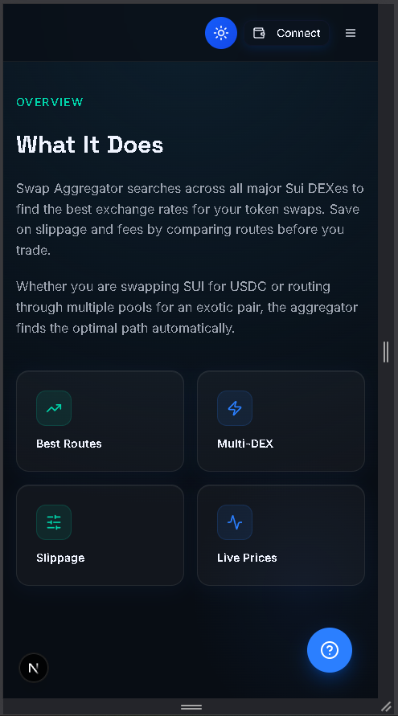
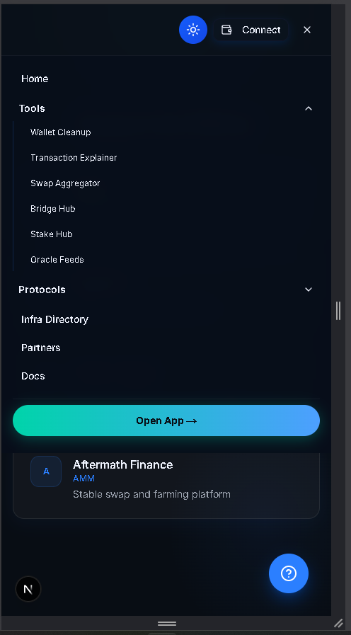
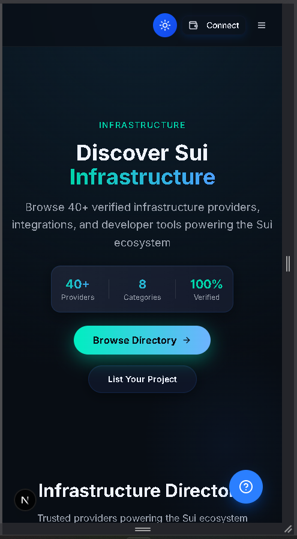

# Atlas Protocol — The Hub for Sui (Landing & Provider Portal)

> The marketing site and ecosystem/provider portal for Atlas Protocol — a discovery hub for the Sui ecosystem. The interactive dApp (swap, bridge, stake, wallet tools) runs as a separate application.

**Status:** Landing & portal — builds and runs locally.

## Screens

<p align="center">
  
  
  
</p>

## Overview

Atlas aggregates Sui protocols, infrastructure providers, tools, and curated knowledge into one designed hub. This repository is the public-facing landing site and provider directory; it showcases the tools and links out to the interactive app.

## Features

- **Protocol ecosystem directory** — protocols across ~19 categories (wallets, DEX, bridges, perps, lending, liquid staking, oracles, NFT, RWA, gaming, SocialFi, DePIN, storage, identity, launchpads, prediction markets, AI agents, BTC primitives, hardware wallets).
- **Infrastructure provider portal** — listings, provider applications, ratings, and an admin moderation dashboard (approve / reject / feature).
- **Tool overview pages** — swap, bridge, stake, oracle feeds, explorer, wallet cleanup, and an AI transaction explainer, each linking to the live app.
- **Support** — partner tiers, docs hub, contact, and legal pages.
- **Graceful degradation** — Supabase calls fall back to a mock client when env vars are absent, so the site builds and runs without secrets.

## Tech Stack

| Layer | Technology |
|-------|------------|
| Framework | Next.js 16 (App Router), React 19 |
| Styling | Tailwind CSS v4, shadcn/ui, Space Grotesk + Inter |
| Backend | Supabase (Postgres) — optional, with mock fallback |
| Hosting | Vercel |

## Architecture

Supabase tables: `provider_listings`, `provider_applications`, `cookie_consents`, `risk_disclaimers`. SQL migrations in `scripts/`. Design system uses a strict 5-color palette: background `#070D1A`, foreground `#F0F4FF`, primary `#2B7FFF`, muted `#0F1629`.

## Getting Started

```bash
npm install --legacy-peer-deps
cp .env.example .env.local     # optional — runs with a mock client if omitted
npm run dev                    # http://localhost:3000
```

## Known Limitations

- The interactive dApp is a separate deployment; this repo is the landing/portal layer.
- Configure Supabase for live provider data.
- Pin Next.js to a patched 16.x release.

## Notes

Shared as a portfolio artifact demonstrating product and system design.
