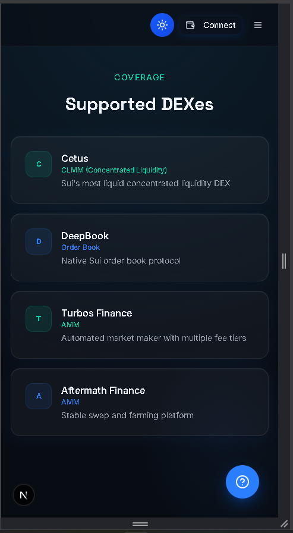
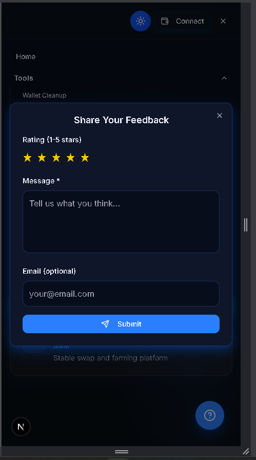
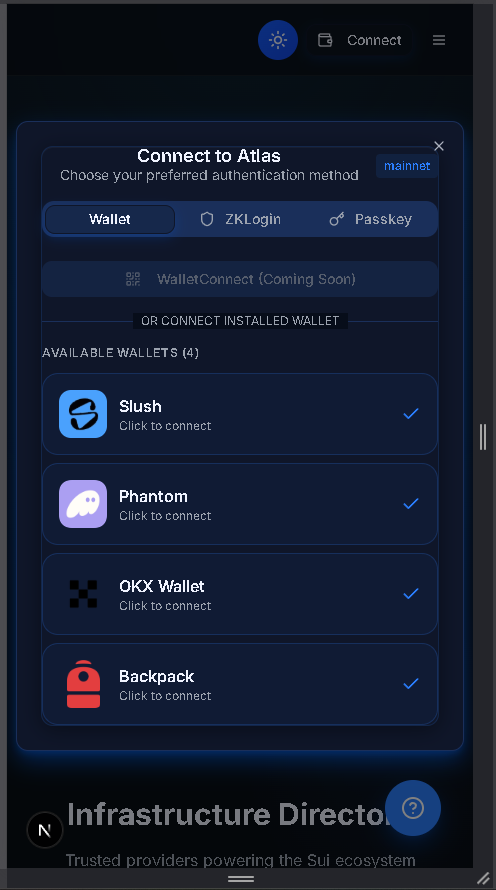

<div align="center">

# Sui DeFi Ecosystem Website

**The ecosystem gateway for Atlas on Sui**

[](https://sui.io)
[](https://nextjs.org)
[](https://www.typescriptlang.org)
[]()

*The front door to the Atlas ecosystem - products, docs, and community in one place.*

</div>

> **Available for development and custom work.** This is a working prototype / showcase. I can build and deliver the complete product - including the private production backend - or adapt it for your needs, under a development agreement (post-agreement fee). **Get in touch:** https://github.com/plinkdev1


> **Related:** the on-chain dApp -> [sui-defi-dapp](https://github.com/plinkdev1/sui-defi-dapp)

---

## What Is This?

Atlas is a DeFi ecosystem built on Sui. This is its public-facing website: the landing experience, ecosystem overview, and gateway into the Atlas dApp, documentation, and community.

---

## Features

| Feature | Description | Status |
|---|---|:---:|
| Landing / hero | Animated marketing landing | ✅ |
| Ecosystem overview | What Atlas is and how the pieces fit | ✅ |
| Product gateway | Links into the Atlas dApp and tools | ✅ |
| Docs & community | Resource and social links | ✅ |
| Responsive design | Mobile-friendly layout | ✅ |

---

## How It Works

```
Landing / hero
     │
     ├─▶ Ecosystem overview
     ├─▶ Atlas dApp
     └─▶ Docs · community
```

---

## Tech Stack

| Layer | Technology |
|-------|------------|
| Frontend | Next.js, React, TypeScript |
| Styling | Tailwind CSS, shadcn/ui |
| Ecosystem | Sui |

---

## Project Structure

```
sui-defi-ecosystem-website/
.vscode/
   settings.json
app/
   about/
   admin/
   api/
   auth/
   bridge-hub/
   cetus-test/
components/
   ui/
   ad-carousel.tsx
   ad-management-modal.tsx
   admin-dashboard-content.tsx
   admin-moderation-dashboard.tsx
   airpoints-display.tsx
contracts/
   sources/
   deployed_addresses.json
   Move.toml
docs/
   ADMIN_PARTNERS_SYSTEM.md
   advertising-guide.md
   Airpoints-Guide.md
   ARCHITECTURE.md
   ARRAY-CALLBACK-FIXES.md
   ATLAS_BUILD_PLAN.md
hooks/
   use-airpoints-earn.ts
   use-airpoints-sync.tsx
   use-airpoints.ts
   use-analytics.ts
   use-mobile.ts
   use-pro-status.ts
lib/
   db/
   supabase/
   admin-auth.ts
   admin-check.ts
   ads-data.ts
   ai-explain-utils.ts
public/
   images/
   logos/
   3d-coin-atlas.png
   atlas-logo.png
   footer-effect.png
   icon.svg
scripts/
   001_create_wallet_users_schema.sql
   002_create_user_profiles_table.sql
   003_create_user_data_table.sql
   004_create_providers_table.sql
   005_add_admin_moderation.sql
   006_create_entitlements_table.sql
styles/
   globals.css
types/
   advertising.ts
   chain-id.ts
   database.ts
   subscription.ts
utils/
   api/
.gitignore
build_output.txt
build_output_2.txt
components.json
CONTRIBUTING.md
DATABASE_MIGRATION_STATUS.md
next.config.mjs
next-env.d.ts
package.json
package-lock.json
postcss.config.mjs
proxy.ts
README.md
tsconfig.json
```

---

## Screenshots

<table>
<tr><td width="50%"></td><td width="50%"></td></tr>
<tr><td width="50%"></td><td width="50%"></td></tr>
<tr><td width="50%"></td><td width="50%"></td></tr>
</table>

---

## Getting Started

```bash
npm install --legacy-peer-deps --ignore-scripts
npx next dev
```

---

## Notes

Shared as a portfolio artifact demonstrating product and system design. Early prototype, not a finished product.

<div align="center">

Built on Sui · MIT

</div>
